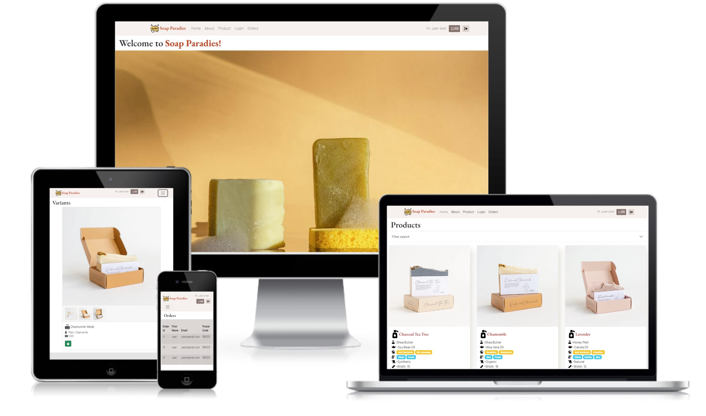
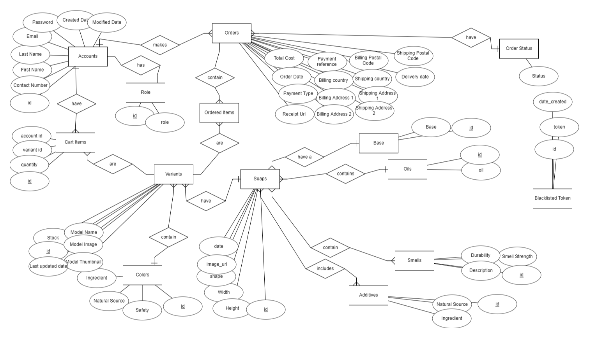
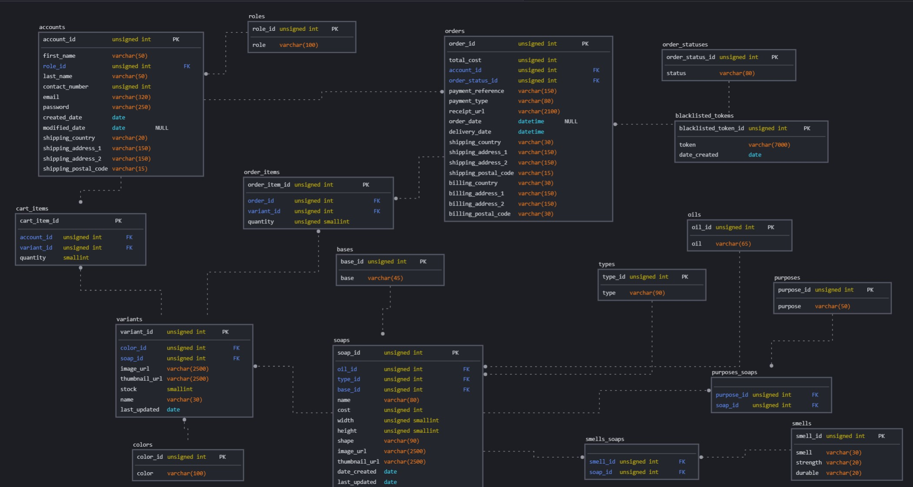
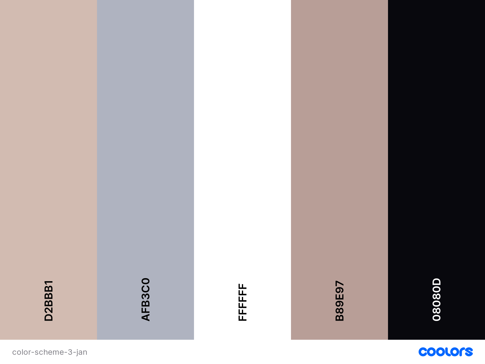

# Soap Paradies

Access live demo site [Soap Paradies](https://project-03-soap-paradies.netlify.app/)



Test Account:
1. Staff interface at https://tgc-20-project-03-timothy-ho.onrender.com/
 - Owner account (can do all functions)
    - email: owner@gmail.com
    - password: Password@123

 - Admin account (Able to edit variants only. Cannot post/edit products only, cannot edit orders, cannot create new accounts)
    - email: staff@gmail.com
    - password: Password@123

2. Customer at https://project-03-soap-paradies.netlify.app/
 - email: user@gmail.com
 - password: Password@123

## Background

Soap is an important aspect of daily hygiene. However, there are few websites allowing the sale of artisanal, customised soap catering to each and every user's need.  

## Project Overview

Soap users are interested in the ingredients, smells and purposes of their soaps. They care about the skin product they use on themselves.

Looking at the range of soaps can help customers understand about the origins and functionalities of the soap. 
They are able to search certain soaps based on criteria of cost, ingredients. They can view further details of the variant of each soap differing in strength, colors to customise to their individual wants. 

---

## The Five Planes of UI/UX

### Strategy

#### Organization's Goals
I usually see soap advertisments online of generic commercial soap products. Handmade artisanal soap lack the publicity and the channels to promote their benefits and craft to public audience. 

#### Users' Goals
 The users of this site are usually aged 25 -40, use the internet for looking up soap products, conducting research into the skin products they utilise. They would like to know the benefits of a soap, compare with other types of soap, and see the cost and presentation of a handmade crafted soap.

1. **Organisation**
   - Objective: To display a range of soaps with its purpose and product details to soap customers

2. **Users: Skincare enthusiast**
   - Objective: To find a soap best suited for their skin characteristics at a reasonable price 

   - Needs:
      - Search about the soap based on ingredients, smells and presentation
      - Understand description and properties of soap
      - Checkout and buy desired soap
   
   - Demographics and Characteristics:
       - Understand skin conditions 
       - Interest in research
       - Enjoys aesthetic looking soaps
   
   - Pain point:
       - Want to know the specific details of a soap 
       - Want to see the look of a soap
       - Want to know the price of a soap


User Stories | Acceptance Criteria(s)
------------ | -------------
As a soap enthusiast, I want to see a selection of soap for my interest. | Website must allow display variety of soaps.
As a soap enthusiast, I want to research abouts the uses and benefits of a soap.| Website must allow display of purpose of soap.
As a soap enthusiast, I would like to understand the ingredients used in my soap. | Website must reveal the base and oil used in the soap.
As a soap enthusiast, I require to know the cost of the soap and be able to buy it. | Website show the cost of the soap and allow user to add the soap to a checkout.


### Scope

### Database


ERD presents an overview of relationship between the entities, in order to base the SQL upon.



Logical Schema Diagram portrays the relationship between tables and the data type within each table. 

In order to allow the website to draw upon a database, a backend server is used. This is the Express backend which is deployed on [Render](https://render.com/). API route URL is set as https://tgc-20-project-03-timothy-ho.onrender.com/api/.

#### Content
The shop owner will populate the details and products for their ecommerce shop. They can oversee and manage their products, variants and orders. The creation of new staff accounts can only be done by the shop owner using the link https://tgc-20-project-03-timothy-ho.onrender.com/accounts/register

#### eCommerce
- Allow search of soap products by name, cost, width, height, oils, smells.
- Create a new customer account. 
- Login with customer account and add items to cart for checkout. 
- Submit payment and view paid orders as a customer. 

#### Staff
- Allow search of soap products by name, cost, width, height, oils, smells.
- Review soap products and see its respective variants, to know the name, stock, last update, color. 


#### Owner
- Create new staff accounts.
- Create, update, delete and read all available products and variants
- Able to view orders and update its status

#### Staff
- View only products.
- Able to add and edit new variants to existing products.

#### Non-functional
- Mobile responsiveness: user-friendly layout on the mobile phone. 
- Accessibility: Large, clear text with readable font colors. 
- Performance: Ensure data storage of each entry use reasonable amount of space to store column data (length of varchar is limited).

#### Branding

The name Soap Paradies is a direct and catchy name for soap customers. They inform the users of the purpose of the site. It also lets user know that this site is a go-to place to understand customised hand made soaps as it is the paradise for soap enthusiasts. 

EB Garamond is a Serif font used to display a more elaborate design for the headers and brand name on the website. This is to create a more sophisticated and artistic feel to assure users that the soaps are of a certain aesthetic quality. Barlow is another font used as it is readable and portrays a clean, modern look - in line with the messaging of soap products. 

#### Color Scheme

EDIT


- Maroon Red is a vibrant and refreshing color for viewers.
- Light Brown is a contrasting color that complements maroon red and is used to highlight the contrast of the red.
- White is used to give a modern and clean look.
- Black is used to display font clearly.
- Beige is used to create soothing and welcoming look for the site.

## Testing
Test Cases can be found [here](./src/images/project-03-test-cases.pdf)


---


## Limitations and Future Implementations

| Limitations | Future Implementations |
| -------- | ----------- |
| The validation will sometimes show when a new user account is created. | Consider switching out of Simple React Validator to manual validation to address issue. |
| To improve the aesthetics, multi-select dropdown list could be enhanced. | Use UIUX like Dribble Multi-select dropdown list. | 

## Dependencies and Sources

### Backend
1. [Express](https://expressjs.com/) as providing access to the API endpoints. 
2. [db-migrate](https://db-migrate.readthedocs.io/en/latest/) allows creation of data migration.
3. [Axios](https://axios-http.com/) client that consumes endpoints
4. [Bookshelf.js](https://bookshelfjs.org/api.html) for creating model of SQL database. 
5. [caolan forms](https://github.com/caolan/forms) to generate and validate BE forms on administrator page. 
7. [cors](https://www.npmjs.com/package/cors) enable CORS
8. [dotenv](https://www.npmjs.com/package/dotenv)  to store away information 
9. [express-session](https://www.npmjs.com/package/express-session) as the session management middleware
10. [express-flash](https://github.com/RGBboy/express-flash) to display messages on BE
11. [jsonwebtoken](https://github.com/auth0/node-jsonwebtoken) to authenticate FE requests to the BE
12. [handlebars](https://handlebarsjs.com/) as the HTML language for BE site. 
15. [Cloudinary](https://cloudinary.com/documentation) to upload and store image of soap products. 

### Frontend
1. [React](https://reactjs.org/) interface to display FE
2. [React Router DOM](https://reactrouter.com/docs/en/v6/getting-started/overview) to provide the path to different FE routes
3. [Axios](https://axios-http.com/) client that goes to API endpoints
5. [React Bootstrap](https://react-bootstrap.github.io/)to style the site, forms and provide interactive features
6. [stripe](https://stripe.com/en-gb-sg) to provide online payment
7. [react-icons](https://react-icons.github.io/react-icons/) to provide tag icons 
8. [FontAwesome](https://fontawesome.com/) for product icons. 
9. [Google Fonts](https://fonts.google.com/) To customise fonts for FE. 
10. [Simple React Validator](https://www.npmjs.com/package/simple-react-validator) to validate forms on FE.

### Platforms and Software
1. [Git](https://git-scm.com/) to commit and push branches
2. [GitHub](http://github.com) for the repository
3. [Gitpod](https://gitpod.io/workspaces) IDE
4. [Render](https://render.com/) to deploy BE server
5. [Netlify](https://www.netlify.com/) to deploy FE React app


### Images and Logos
1. Product images is obtained from [Mira](https://mirasingapore.com/collections/artisan-soaps)
2. Site photos are from [Pexels](https://www.pexels.com/search/soap/)
3. Brand icon is from [Favicon](https://favicon.io/favicon-generator/)

### Other Attributions
1. [Paul Chor](https://github.com/kunxin-chor) tutorial in providing guidance on creating app
2. Wesley and Yong Sheng (Teaching Assistants) for their guidance and support.
3. [Jun Hao](https://github.com/JunHao-k/wanderlust_fe) reference for ReadMe file and backend deployment advice
---


## Deployment

### Build
Build using Node.js and Express on the Backend. React Frontend is built through the create-react-app.

### Backend Deployment
Express server is deployed using [Render](https://render.com/).

Prerequisites:
- Github account is authorised on Render deployment.
- Backend Github folder is synced with Render deployment.
- Auto updates to Render is triggered when changes are pushed to 
Github repository. 

Steps to publish:
1. Push changes to Github to ensure latest version is deployed on Render.
2. Render will update changes with new pushses.

### Frontend Deployment

The React app is hosted using [Netlify](https://www.netlify.com/).

Prerequisites:
-  Github account is authorised on Render deployment.
- Frontend Github folder is synced with Netlify deployment.
- Auto updates to Netlify is triggered when changes are pushed to 
Github frontend repository. 

Steps to publish:
1. Push changes to Github to ensure latest version is deployed on Netlify.
2. Netlify will update changes with new pushses.


### Database migrations
Database can be recreated to any SQL base template using this command:
```
node database/db-migrate-up.js
```

The command will reproduce existing tables and default data, excluding details such as staff accounts, customer accounts, cart items, orders, payments, products and variant.


EDIT
The Express server makes use of the following environment variables:

```
SESSION_SECRET_KEY=

CLOUDINARY_NAME=
CLOUDINARY_API_KEY=
CLOUDINARY_API_SECRET=
CLOUDINARY_UPLOAD_PRESET=

DB_DRIVER=
DB_USER=
DB_PASSWORD=
DB_DATABASE=
DB_HOST=

TOKEN_SECRET=
REFRESH_TOKEN_SECRET=

STRIPE_PUBLISHABLE_KEYS=
STRIPE_SECRET_KEY=

STRIPE_SUCCESS_URL=
STRIPE_CANCEL_URL=
STRIPE_ENDPOINT_SECRET=
```

---
